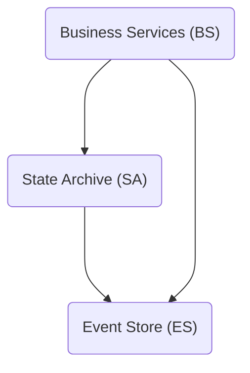
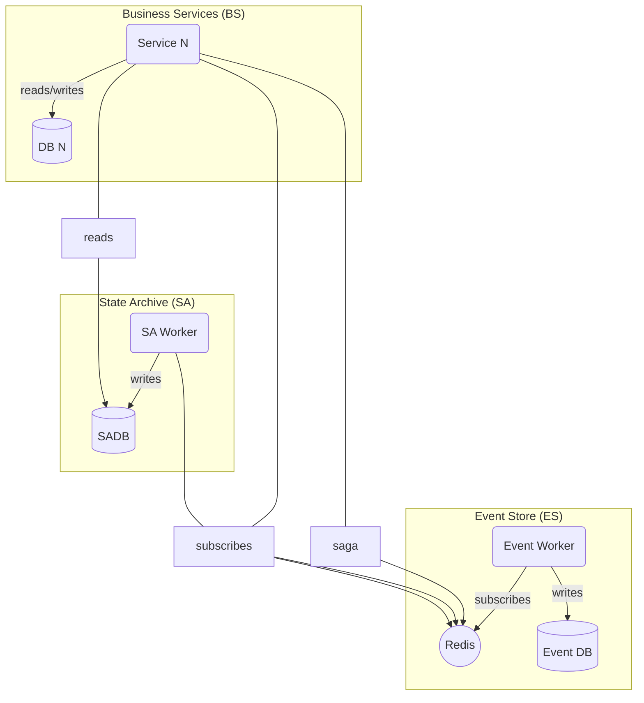

# Architecture

---

## 1. Logical perspective

## 2. Process perspective

## 3. Development perspective

Codebase is organized as a monorepo with the following notable components:

| Component | Path       | Description                                                                                              |
| --------- | ---------- | -------------------------------------------------------------------------------------------------------- |
| API       | ./api      | Contains Business Service (BS) codebases                                                                 |
| Packages  | ./packages | Shared libraries                                                                                         |
| Runtime   | ./runtime  | Contains runtime instances that are needed for a functional deployment (Event Store, State Archive, ...) |
