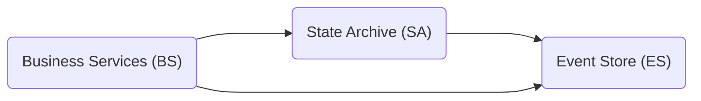
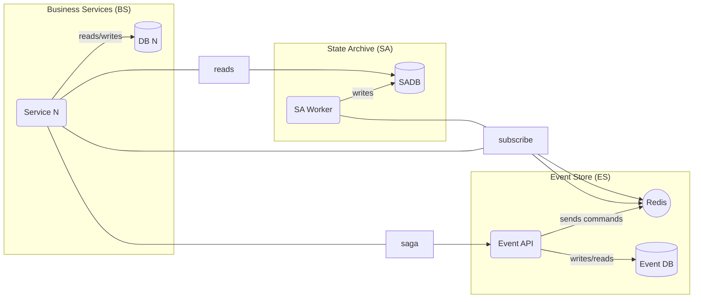

# Architecture

---

## 1. Logical perspective

```mermaid
flowchart LR
  bs("Business Services (BS)")
  sa("State Archive (SA)")
  es("Event Store (ES)")

  bs ---> sa
  sa ---> es
  bs ---> es
```

## 2. Process perspective

```mermaid
flowchart LR
  subgraph bs ["Business Services (BS)"]
    direction LR

    bsService(Service N)
    bsDb[(DB N)]
    
    bsService --reads/writes--> bsDb
  end
  
  subgraph sa ["State Archive (SA)"]
    direction LR
    
    saWorker(SA Worker)
    saDb[(SADB)]
    
    saWorker --writes--> saDb
  end
  
  subgraph es ["Event Store (ES)"]
    direction LR
  
    esApi(Event API)
    esBrokerer((Redis))
    esDb[(Event DB)]
    
    esApi --sends commands--> esBrokerer
    esApi --writes/reads--> esDb
  end
  
  bsService ----reads---> saDb
  bsService ----saga--> esApi
  bsService ----subscribe--> esBrokerer
  saWorker ----subscribe--> esBrokerer
```
