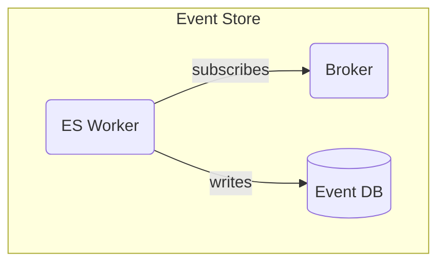

# Event Store Design

This document describes the architectural, external and detailed design for the Event Store.

## Architecture

## External Design

The external interface of the Event Store is the external interface of the Broker. Interaction with the Broker will be done via an adapter package. Instead of using the adapter provided by whatever messaging technology we use, implementing a shared adapter package will ensure flexibility if the need for using multiple broker ever arise.

For more comprehensive details, refer to the README of the adapter package.
