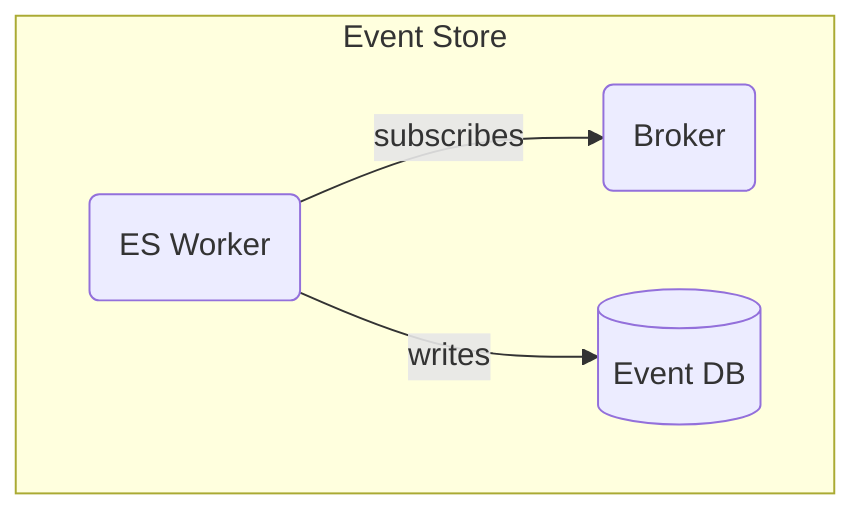

# Event Store Design

This document describes the architectural, external and detailed design for the Event Store.

## Architecture

## External Design

The external interface of the Event Store is the external interface of the Broker. Interaction with the Broker will be done via an adapter package. Instead of using the adapter provided by whatever messaging technology we use, implementing a shared adapter package will ensure flexibility if the need for using multiple broker ever arise.

For more comprehensive details, refer to the README of the adapter package.

## Detailed Design

### Broker/Broker Adapter

Redis is the chosen message broker based on popularity, documentation and well tested uses. For more comprehensive details, refer to the README of the adapter package.

### Event Database

SQLite is the chosen main database for the Event Store for the key reason that it is lightweight, and as such, very suitablee for storing simple events. Additionally, since the main entity that will be stored here are events and their payloads, leveraging a more robust database technology is unnecessary.

### Event Worker

The Event Worker subscribes to the broker and wait for transactional commands to bee published. It then writes the data of these commands to the database.
